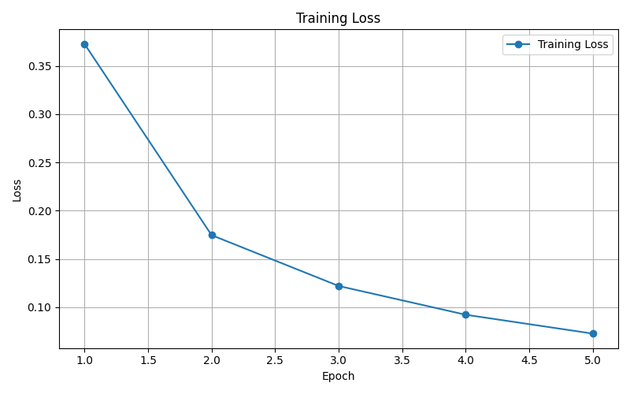
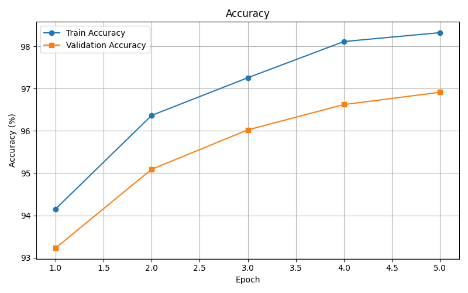
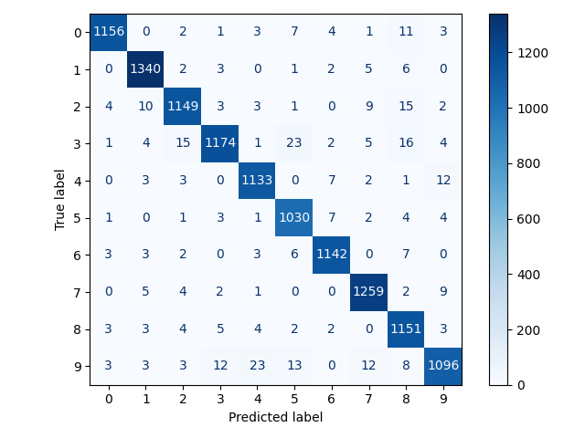

# MNIST MLP PyTorch

A clean PyTorch implementation of a multilayer perceptron for handwritten digit classification on the MNIST dataset. The project trains a fully connected neural network, validates it on a reproducible split, saves the best checkpoint, generates evaluation plots, and includes inference helpers for loading the trained model.

## Project Overview

MNIST is a classic computer vision dataset containing 28x28 grayscale images of handwritten digits from 0 to 9. This project uses a multilayer perceptron (MLP), which flattens each image into 784 input features and learns a hidden representation before predicting one of 10 digit classes.

PyTorch is used for model definition, training, GPU acceleration, checkpointing, and inference. The code is organized as a small production-style repository instead of a single notebook so it is easier to test, reuse, and extend.

## Features

- Reproducible seed setup
- Train/validation split
- Accuracy logging per epoch
- Validation accuracy tracking
- GPU support with CPU fallback
- Best checkpoint saving
- Inference utilities
- Training loss and accuracy visualization
- Confusion matrix and classification report

## Folder Structure

```text
mnist-mlp/
├── src/
│   ├── __init__.py
│   ├── model.py
│   ├── dataset.py
│   ├── train.py
│   ├── inference.py
│   ├── utils.py
│   └── config.py
├── notebooks/
│   └── training.ipynb
├── checkpoints/
│   └── best_model.pth
├── data/
├── images/
│   ├── training_loss.png
│   ├── accuracy.png
│   └── confusion_matrix.png
├── requirements.txt
├── README.md
├── .gitignore
├── LICENSE
└── main.py
```

## Installation

```bash
pip install -r requirements.txt
```

## Run

```bash
python main.py
```

Running the entry point downloads MNIST if needed, trains the MLP, saves the best checkpoint to `checkpoints/best_model.pth`, generates plots in `images/`, prints a classification report, and runs a sample inference prediction.

## Results

| Metric | Value |
| --- | --- |
| Dataset | MNIST |
| Model | MLP |
| Input size | 784 |
| Hidden size | 128 |
| Classes | 10 |
| Epochs | 5 |
| Best validation accuracy | 96.92% |

## Sample Output

```text
Using Device: cpu

Starting Training...

Epoch [1/5] | Loss: 0.3978 | Train Accuracy: 93.28% | Validation Accuracy: 92.89%
Best model saved.

Epoch [2/5] | Loss: 0.1895 | Train Accuracy: 95.65% | Validation Accuracy: 95.12%
Best model saved.

============================================================
Best Validation Accuracy: 97.00%
============================================================

Best model loaded successfully!

Classification Report
---------------------
...

Inference Demo
----------------
Actual Label     : 5
Predicted Label  : 5
```

## Screenshots

Training and evaluation images are generated automatically:







## Inference

```python
from src.dataset import load_dataset
from src.inference import load_model, predict

model = load_model()
dataset = load_dataset(train=False)
image, label = dataset[0]
prediction = predict(model, image)

print(f"Actual: {label}, Predicted: {prediction}")
```

## Future Improvements

- Replace the MLP with a CNN for better image feature extraction
- Add FashionMNIST as an alternate dataset
- Build a Streamlit demo
- Build a Gradio demo
- Package and deploy the model as a web service
